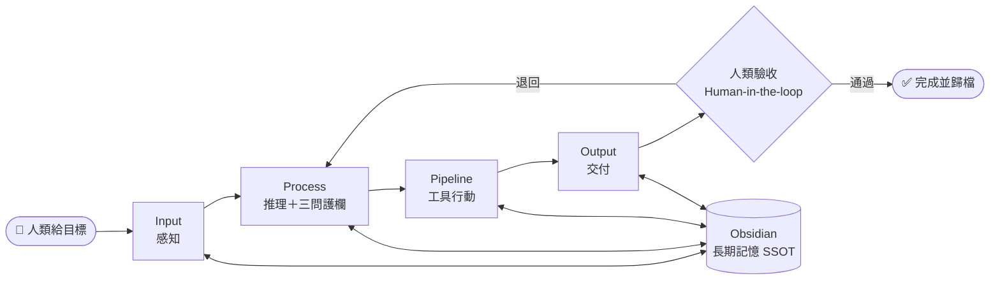
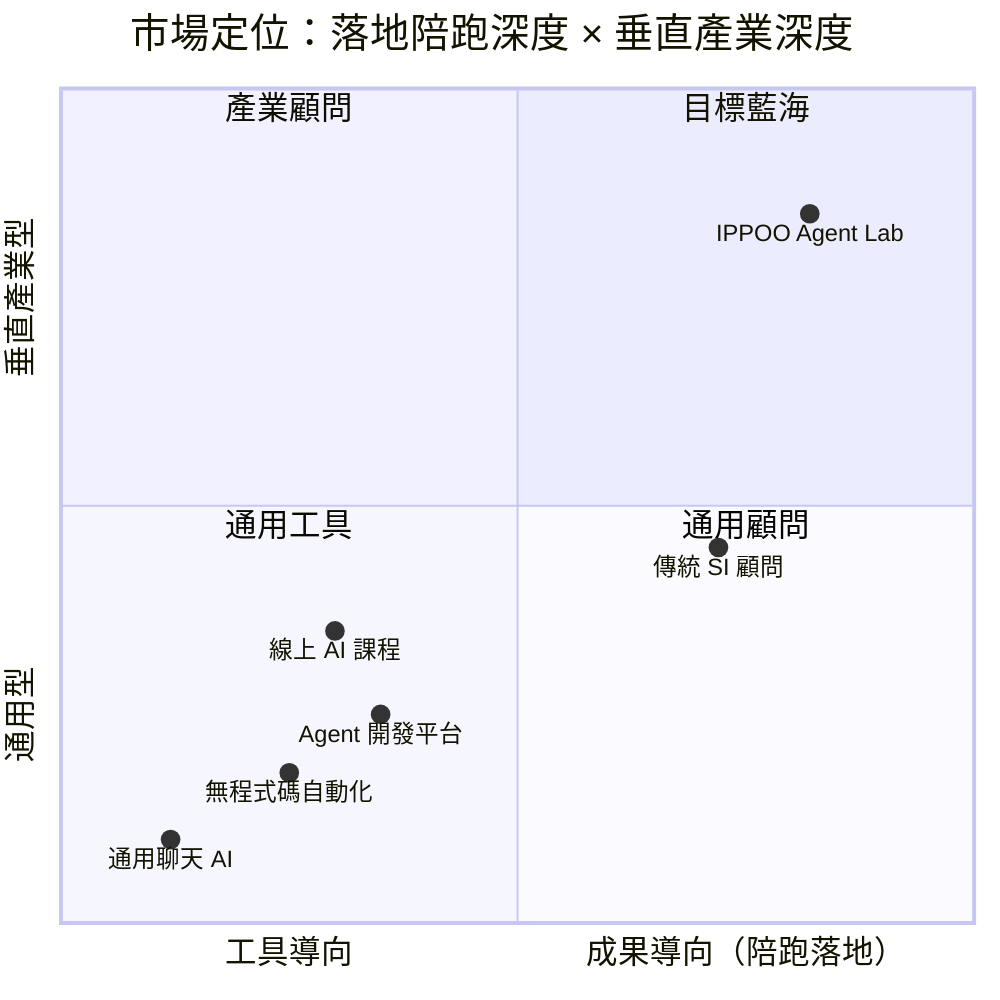
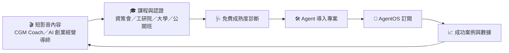
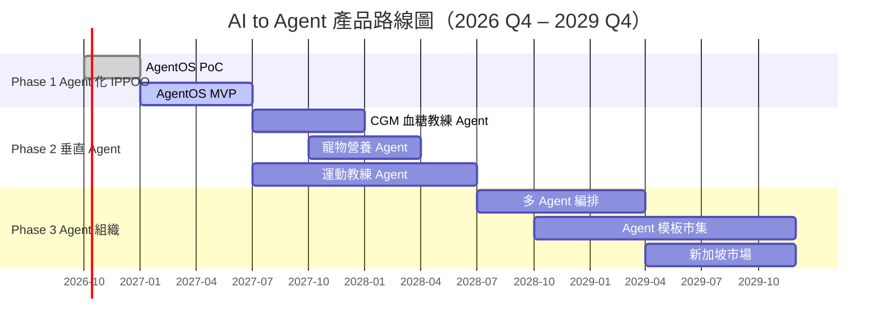

# AI to Agent 創業計劃書：IPPOO Agent Lab

> **文件版本**：v1.0（投資人審閱版草案）
> **提案人**：陳俊宏（AI Coach 益力康陳董）
> **最後更新**：2026-09-30
> **幣別**：新台幣（NT$），財務數字除特別註明外以「萬元」為單位
> **方法論基礎**：[IPPOO 智慧知識轉換框架與 SOP](./IPPOO-SOP-Technical-Doc.md)

> [!note] 閱讀須知
> 本計劃書中的市場規模、財務預測與單位經濟學皆為**規劃假設**，已在各表格註明推算邏輯；標示 `[待填]` 之處需以實際營運數據或最新官方統計補齊後，再對外提供給投資人。

---

## 目錄

- [0. 核心觀念：什麼是 AI to Agent](#0-核心觀念什麼是-ai-to-agent)
- [1. 執行摘要](#1-執行摘要executive-summary)
- [2. 市場問題與痛點](#2-市場問題與痛點problem--pain-points)
- [3. 產品與解決方案](#3-產品與解決方案product--solution)
- [4. 市場分析與競爭格局](#4-市場分析與競爭格局market-analysis--competition)
- [5. 商業與營收模式](#5-商業與營收模式business--revenue-model)
- [6. 營運與研發規劃](#6-營運與研發規劃operations--roadmap)
- [7. 組織與團隊介紹](#7-組織與團隊介紹team--advisory)
- [8. 財務預測與融資需求](#8-財務預測與融資需求financial-projections--ask)
- [附錄 A：風險與對策](#附錄-a風險與對策)
- [附錄 B：名詞對照](#附錄-b名詞對照)

---

## 0. 核心觀念：什麼是 AI to Agent

### 0.1 一句話定義

> **AI 是「你問、它答」的工具；Agent 是「你給目標、它把事做完」的數位員工。**
> **AI to Agent** ＝ 讓企業從「人追著 AI 跑」，升級為「Agent 替人跑、人只做決策」。

### 0.2 費曼式比喻：從「計算機」到「實習生」再到「店長」

| 階段 | 比喻 | 人的角色 | 典型例子 |
|---|---|---|---|
| **AI（工具）** | 一台很聰明的計算機 | 每一步都要自己按 | 在 ChatGPT 貼逐字稿、要一份摘要 |
| **Workflow（流程）** | 一條固定的輸送帶 | 設計好流程，機器照做 | 每週影片自動轉字幕、自動剪短影音 |
| **Agent（智能體）** | 一位會自己查資料、會用工具、會回報的實習生 | 給目標、驗收、在關鍵點拍板 | 「幫我把這週 5 支教學影片轉成課綱、圖卡、短影音腳本，並存進知識庫」 |
| **Multi-Agent（組織）** | 一間有分工的小公司 | 當董事長：定方向、看儀表板 | 研究 Agent ＋ 驗證 Agent ＋ 設計 Agent ＋ 客服 Agent 協作 |

### 0.3 AI to Agent 成熟度五階（L0–L4）

| 等級 | 名稱 | 判斷標準 | 企業常見狀態 |
|---|---|---|---|
| **L0** | 未導入 | 沒有使用生成式 AI | 傳統中小企業 |
| **L1** | AI 對話 | 員工個人使用聊天機器人，產出無法累積 | **多數企業卡在這裡** |
| **L2** | AI 工作流 | 有固定 SOP ＋ 自動化腳本，但遇到例外就中斷 | 少數數位化程度高的團隊 |
| **L3** | 單一 Agent | 能拆解目標、呼叫工具、讀寫記憶、自我檢查 | 本公司主力導入目標 |
| **L4** | Agent 組織 | 多個 Agent 分工協作，人類只在治理節點介入 | 本公司 3 年後的旗艦服務 |

### 0.4 Agent 的五大構件 × IPPOO 五層（本公司的方法論護城河）

**Agent ＝ 大腦（模型）＋ 記憶 ＋ 手腳（工具）＋ 規劃 ＋ 護欄**

IPPOO 框架原本是「多模型協作的知識生產線」，本計劃將它**升級為 Agent 的作業系統**：

| IPPOO 層級 | 對應 Agent 構件 | 在 Agent 中的職責 | 技術實作 |
|---|---|---|---|
| **I**nput | 感知（Perception） | 讀取影片、文件、CGM 數據、客服對話等多模態輸入 | Gemini / NotebookLM / Whisper |
| **P**rocess | 推理＋護欄（Reasoning & Guardrails） | 費曼複述、第一性原理、反例驗證「三問」＝ Agent 的自我檢查迴圈 | Claude |
| **P**ipeline | 行動（Action / Tools） | 呼叫外部工具、執行自動化腳本 | Claude Code、MCP 工具鏈 |
| **O**utput | 交付（Delivery） | 依品牌規範產出圖卡、簡報、報告、短影音 | 視覺化模型、設計系統 |
| **O**bsidian | 長期記憶（Memory / SSOT） | 所有 Agent 共用的外部記憶體，本機 Markdown、可追溯 | Obsidian Vault、雙向連結 |



> **關鍵差異**：一般 Agent 平台賣的是「會動的 Agent」；我們賣的是「**會動、而且做對、還記得住**的 Agent」——
> 「做對」靠 Process 三問護欄，「記得住」靠 Obsidian 外置記憶，「不被單一模型綁架」靠多模型分工。

---

## 1. 執行摘要（Executive Summary）

### 1.1 創業宗旨與願景

- **使命**：讓每一家中小企業都擁有「會做事、做得對、記得住」的 AI Agent 數位員工。
- **願景**：成為華語市場「**垂直產業 AI to Agent 轉型**」的第一品牌——從大健康、寵物新零售、教育培訓到運動休閒。
- **一句話定位**：**讓 AI 幫你「快」，讓 Agent 幫你「做完」，讓框架幫你「準」。**

### 1.2 核心產品／服務概述

| 產品線 | 內容 | 客群 |
|---|---|---|
| **① IPPOO AgentOS**（SaaS） | 以 Obsidian 為記憶中樞、多模型協作的 Agent 作業平台；內建三問護欄與 Agent 模板庫 | 中小企業、顧問、知識工作者 |
| **② Agent 導入陪跑專案** | 「AI to Agent 成熟度診斷 → 客製 Agent → 上線陪跑」一條龍 | 年營收 NT$3,000 萬以上中小企業 |
| **③ AI to Agent 培訓認證** | 企業內訓、大學課程、公開班與「Agent 建構師」認證 | 企業員工、大專院校、創業者 |
| **④ 垂直 Agent 應用**（B2C/B2B2C） | CGM 血糖教練 Agent、寵物營養 Agent、高爾夫揮桿教練 Agent | 血糖管理族群、飼主、球友 |

### 1.3 目標市場與規模（詳見第 4 章）

| 層級 | 定義 | 規模（年） |
|---|---|---|
| **TAM** | 台灣具數位化支出能力之中小企業 × 年均 AI／Agent 預算 | 約 **NT$300 億** |
| **SAM** | 聚焦四大垂直產業＋知識型服務業 | 約 **NT$30 億** |
| **SOM** | 第 3 年可取得之營收（約 SAM 1.6%） | 約 **NT$4,720 萬** |

### 1.4 競爭優勢與核心壁壘（護城河）

1. **方法論壁壘**：IPPOO 五層框架已文件化（v1.0 SOP），把 Agent 的「品質控管」變成可複製的標準流程。
2. **跨界領域知識壁壘**：創辦人橫跨生技（血糖）、寵物新零售、國家級運動教練、AI 認證講師，垂直 Agent 的專業知識不是工程師能從網路抓到的。
3. **通路壁壘（教育帶動成長）**：資策會／工研院 AI 認證講師、三所大學業界講師、工商團體會員身分 → 以課程取得低成本、高信任的客戶。
4. **資料主權壁壘**：本機 Markdown 記憶層，企業知識不外流、不被單一模型供應商綁定，切換模型成本趨近於零。
5. **內容飛輪壁壘**：CGM Coach 與 AI 創業經營導師雙自媒體持續產出案例內容，形成自帶流量的獲客引擎。

### 1.5 融資需求與預期里程碑

- **本輪**：種子輪 **NT$1,500 萬**，出讓股權 **20%**（投前估值 NT$6,000 萬）
- **資金可支撐**：24 個月以上跑道，涵蓋至損益平衡並保留安全緩衝

| 時間 | 里程碑 |
|---|---|
| 2026 Q4 | 完成種子輪；AgentOS PoC（IPPOO 框架＋高爾夫揮桿 Agent 原型） |
| 2027 Q2 | AgentOS MVP 上線；首批 10 家企業導入 |
| 2027 Q4 | 60 家付費企業、垂直 Agent 付費用戶 500 人 |
| 2028 Q3 | **單月損益平衡（第 21 個月）** |
| 2029 Q4 | 550 家付費企業、年營收 NT$4,720 萬、啟動 Pre-A 輪與新加坡市場 |

---

## 2. 市場問題與痛點（Problem & Pain Points）

### 2.1 未被滿足的需求（Unmet Needs）

| # | 痛點 | 現場真實樣貌 |
|---|---|---|
| 1 | **停在 L1：AI 用了，但沒變成生產力** | 員工各自開 ChatGPT，產出散落在對話紀錄，離職就帶走，公司沒有累積 |
| 2 | **多模型各自為政，沒有共享記憶** | Gemini 整理、Claude 驗證、GPT 出圖——每換一個工具就要重貼一次背景 |
| 3 | **AI 會「一本正經地胡說八道」** | 沒有驗證機制，錯誤資訊直接進簡報、衛教單張、客服回覆，風險由企業承擔 |
| 4 | **不知道 Agent 從哪裡開始** | 老闆聽過 Agent，但不知道哪個流程值得做、要花多少錢、多久回本 |
| 5 | **垂直產業缺乏懂行的 Agent** | 通用 Agent 不懂血糖曲線、不懂寵物營養、不懂揮桿力學，產出只能當草稿 |
| 6 | **缺人才** | 中小企業請不起 AI 工程師，外包 SI 報價動輒數百萬，且交付後沒人維運 |

### 2.2 現行替代方案的缺陷

| 替代方案 | 優點 | 缺陷 |
|---|---|---|
| **通用聊天 AI**（ChatGPT／Gemini／Copilot） | 便宜、上手快 | 停在 L1；無流程、無組織記憶、無品質護欄 |
| **無程式碼自動化**（n8n／Make／Zapier） | 可串接工具 | 只到 L2；需要自己設計流程，遇到例外即中斷，中小企業不會維護 |
| **Agent 開發平台**（Dify／Coze 等） | 可快速拼出 Agent | 工具導向而非成果導向；缺乏產業知識與導入陪跑 |
| **傳統 SI／AI 顧問公司** | 可客製 | 成本高（數百萬起）、週期長、交付後知識不留在客戶端 |
| **線上 AI 課程** | 價格低 | 學完不會落地，課程與企業實際流程脫節 |

> **結論**：市場缺的不是更強的模型，而是一套「**懂產業、有方法、能陪跑、會記憶**」的 AI to Agent 轉型服務。

---

## 3. 產品與解決方案（Product & Solution）

### 3.1 產品核心功能架構

```
┌────────────────────────────────────────────────────────────────────┐
│                   ④ 垂直 Agent 應用層（App Layer）                   │
│  CGM 血糖教練 Agent │ 寵物營養 Agent │ 高爾夫揮桿 Agent │ 企業自建 Agent │
├────────────────────────────────────────────────────────────────────┤
│                 ③ Agent 編排層（Orchestration Layer）                │
│  目標拆解 → 任務規劃 → 多模型路由 → 工具呼叫（MCP）→ 人類審核節點        │
├────────────────────────────────────────────────────────────────────┤
│                  ② 品質護欄層（Guardrail Layer）                     │
│  IPPOO 三問：費曼複述 ✚ 第一性原理 ✚ 反例／風險 │ 醫療與個資合規檢查       │
├────────────────────────────────────────────────────────────────────┤
│                  ① 記憶中樞層（Memory Layer / SSOT）                 │
│  Obsidian Vault：本機 Markdown ✚ 雙向連結 ✚ 版本追溯 ✚ 權限分層        │
└────────────────────────────────────────────────────────────────────┘
```

### 3.2 運作邏輯：IPPOO 5-Step Agentization（企業導入五步法）

| 步驟 | 名稱 | 做什麼 | 交付物 |
|---|---|---|---|
| 1 | **Diagnose 診斷** | AI to Agent 成熟度評估（L0–L4）、盤點高頻重複流程 | 成熟度報告、Agent 機會地圖 |
| 2 | **Design 設計** | 選出 ROI 最高的 1–3 個流程，定義 Agent 目標、工具與人類審核點 | Agent 規格書（Obsidian 交接模板） |
| 3 | **Build 建構** | 以 AgentOS 模板組裝 Agent，接上企業記憶庫 | 可運作的 Agent |
| 4 | **Guard 護欄** | 套用三問驗證與產業合規規則，做紅隊測試 | 驗證報告、風險清單 |
| 5 | **Grow 陪跑** | 上線、量測、每月優化；員工完成認證課程 | 月報儀表板、內部 Agent 建構師 |

### 3.3 獨特價值主張（UVP）

> **「不是教你用 AI，而是幫你養一群會做事、做得對、記得住的 Agent 員工。」**

| 對象 | 價值主張 |
|---|---|
| **企業主** | 90 天內把 1 個高頻流程交給 Agent，節省人力工時並留下公司自己的知識資產 |
| **員工** | 從「被 AI 取代」變成「管理 Agent 的人」，並取得可帶走的認證 |
| **B2C 用戶** | 24 小時懂你的專業教練：血糖、寵物營養、揮桿，一支手機就夠 |

### 3.4 目前產品開發進度

| 項目 | 狀態 | 說明 |
|---|---|---|
| IPPOO 框架與 SOP | ✅ 已完成 v1.0 | 已文件化並公開於 GitHub（本 repo） |
| Obsidian 交接模板 | ✅ 已完成 | 五段式交接文件，可直接作為 Agent 記憶格式 |
| 高爾夫揮桿影片教練 Agent | 🟡 PoC | 以 MediaPipe 自動拆關鍵幀，產出分段教練指導與 4 週練習計畫 |
| 短影音自動化產線 | 🟡 PoC | Whisper → ffmpeg → Auto-Editor → ImageMagick → ElevenLabs → Pexels API |
| CGM 血糖教練 Agent | 🔵 規劃中 | 以 CGM Coach 自媒體內容與衛教知識為基礎，定位為生活型態衛教，非醫療診斷 |
| 寵物營養 Agent | 🔵 規劃中 | 結合益生寵愛寵物餐廳營運與寵物保健教學知識 |
| AgentOS 平台 MVP | 🔵 開發中 | 預計 2027 Q2 上線 |
| 既有流量／學員數據 | `[待填]` | 自媒體粉絲數、歷年授課人次、企業輔導家數 |
| 專利／商標 | `[待填]` | 建議優先申請「IPPOO」商標與 Agent 護欄流程之發明／新型專利評估 |

---

## 4. 市場分析與競爭格局（Market Analysis & Competition）

### 4.1 目標受眾畫像（User Persona）

| 畫像 | 描述 | 核心痛點 | 付費動機 | 對應產品 |
|---|---|---|---|---|
| **A. 二代接班中小企業主**<br/>（45 歲、員工 30 人、年營收 NT$1 億） | 知道要轉型，但怕花大錢做 IT 專案 | 人力短缺、知識綁在老員工身上 | 省人力、留知識、看得見 ROI | 導入專案 ＋ AgentOS |
| **B. 健康／寵物產業經營者**<br/>（診所、藥局、營養品牌、寵物店） | 客戶諮詢量大，專業人員時間不夠 | 衛教重複回答、內容產能不足 | 提升服務量又不犧牲專業度 | 垂直 Agent ＋ AgentOS |
| **C. 知識型創作者／顧問**<br/>（講師、教練、自媒體） | 一人公司，內容就是產品 | 素材整理耗時、跨平台產出累 | 一份素材變十份內容 | AgentOS 個人方案 ＋ 認證課程 |
| **D. B2C 終端用戶**<br/>（血糖管理族群、飼主、球友） | 想要隨時可問的專業教練 | 專業諮詢貴且不即時 | 便宜、即時、個人化 | 垂直 Agent 訂閱 |

### 4.2 市場總量估算（TAM／SAM／SOM）

| 層級 | 推算邏輯（假設） | 規模 |
|---|---|---|
| **TAM** 總潛在市場 | 台灣中小企業逾 160 萬家，其中具正式員工與數位工具支出者假設約 **30 萬家** × 年均 AI／Agent 支出 **NT$10 萬** | **≈ NT$300 億／年** |
| **SAM** 可服務市場 | 聚焦大健康／生技、寵物、教育培訓、運動休閒四大垂直＋知識型服務業，假設約 **3 萬家** × NT$10 萬 | **≈ NT$30 億／年** |
| **SOM** 可獲取市場 | 第 3 年營收目標 NT$4,720 萬 ÷ SAM | **≈ 1.6% SAM** |
| **B2C 延伸市場** | 台灣糖尿病人口逾 200 萬人、犬貓飼養數約 300 萬隻量級、高爾夫與匹克球人口持續成長 | 以訂閱滲透率 0.1% 起算 |

> 📌 **校準提醒**：中小企業家數請以經濟部《中小及新創企業白皮書》最新版、寵物數以農業部最新調查、糖尿病人口以國健署統計更新。

### 4.3 競爭對手矩陣

| 比較維度 | **IPPOO Agent Lab** | 通用聊天 AI | 無程式碼自動化 | Agent 開發平台 | 傳統 SI／顧問 |
|---|---|---|---|---|---|
| 成熟度可達 | **L3–L4** | L1 | L2 | L3 | L2–L3 |
| 垂直產業知識 | **高（健康／寵物／運動／教育）** | 低 | 低 | 低 | 中 |
| 品質護欄 | **IPPOO 三問＋產業合規** | 無 | 無 | 基本 | 依專案 |
| 組織記憶與資料主權 | **本機 Obsidian，多模型共用** | 雲端、綁單一供應商 | 無 | 平台內 | 依專案 |
| 導入陪跑 | **診斷→建構→陪跑→認證** | 無 | 社群 | 文件 | 有，但昂貴 |
| 價格帶 | **中** | 低 | 低 | 低–中 | 高 |
| 繁中在地化 | **高** | 中 | 低 | 中 | 高 |

### 4.4 定位象限圖



---

## 5. 商業與營收模式（Business & Revenue Model）

### 5.1 收費模式

| 營收來源 | 模式 | 定價 | 角色 |
|---|---|---|---|
| **① AgentOS 訂閱** | SaaS 月／年訂閱 | 個人版 NT$990／月、團隊版 NT$4,990／月、企業版 NT$20,000 起／月 | 經常性收入（ARR 核心） |
| **② 導入陪跑專案** | 專案制＋首年訂閱綁約 | NT$15–60 萬／案（平均 NT$30 萬起） | 高毛現金流＋轉訂閱入口 |
| **③ 培訓認證** | 內訓／公開班／大學合作／認證費 | 企業內訓 NT$6–12 萬／場；認證 NT$12,000／人 | 低成本獲客引擎 |
| **④ 垂直 Agent** | B2C 訂閱＋B2B2C 分潤授權 | NT$299／月；通路（診所、寵物店）分潤 20–30% | 規模化與品牌聲量 |
| **⑤ Agent 模板市集**（第 3 年） | 交易抽成 | 第三方 Agent 模板抽成 20% | 生態系與網路效應 |

### 5.2 定價策略

- **價值定價，不按 Token 計價**：以「每個 Agent 每月替代的人力工時」作為錨點，例如替代每月 40 小時行政工時（約 NT$1.2 萬人力成本），團隊版 NT$4,990 即具 2 倍以上 ROI。
- **入口低價、陪跑溢價**：免費 AI to Agent 成熟度診斷 → 低價課程 → 專案 → 訂閱，逐層提高信任與客單價。
- **綁約轉換**：導入專案含首年 AgentOS 訂閱，將一次性收入轉為經常性收入。

### 5.3 單位經濟學（Unit Economics）

| 指標 | 企業訂閱（B2B） | 垂直 Agent（B2C） | 推算說明 |
|---|---|---|---|
| 平均月營收 ARPA／ARPU | NT$4,000 | NT$299 | 各方案加權平均 |
| 毛利率 | 75% | 75% | 扣除模型 API 與雲端成本 |
| 每月貢獻毛利 | NT$3,000 | NT$224 | ARPA × 毛利率 |
| 月流失率 | 2.5% | 6% | 保守假設 |
| 平均生命週期 | 40 個月 | 約 17 個月 | 1 ÷ 流失率 |
| **LTV 客戶終身價值** | **NT$120,000** | **≈ NT$3,740** | 每月貢獻毛利 × 生命週期 |
| **CAC 客戶獲取成本** | **NT$18,000** | **NT$900** | 課程導流＋短影音內容獲客 |
| **LTV／CAC** | **6.7×** | **4.2×** | 健康標準 > 3× |
| **CAC 回收期** | **6 個月** | **約 4 個月** | 健康標準 < 12 個月 |

### 5.4 行銷與獲客策略（GTM）：教育帶動成長（Education-Led Growth）



| 階段 | 通路 | 策略 | KPI |
|---|---|---|---|
| **認知** | 短影音、Podcast、Threads／IG | 每週 3 支「AI to Agent 實戰」短影音，拍真實導入案例 | 觸及、名單數 |
| **信任** | 資策會／工研院產業輔導、大學課程、工商團體講座 | 講師身分帶來權威背書，課後提供免費診斷 | 診斷預約率 ≥ 15% |
| **轉換** | 導入專案、團隊版試用 | 「90 天 1 個 Agent 上線」保證方案 | 診斷→專案成交率 ≥ 20% |
| **擴張** | 產業協會、B2B2C 通路 | 糖尿病衛教、寵物友善餐廳協會、運動協會成為垂直 Agent 通路 | 通路合作家數 |
| **推薦** | 認證學員社群、客戶轉介 | 「Agent 建構師」認證學員成為導入夥伴，拆分專案收入 | 轉介佔比 ≥ 25% |

---

## 6. 營運與研發規劃（Operations & Roadmap）

### 6.1 未來 1～3 年產品功能演進

| 階段 | 時間 | AI to Agent 等級 | 產品重點 |
|---|---|---|---|
| **Phase 1：Agent 化 IPPOO** | 2026 Q4 – 2027 Q2 | L2 → L3 | Obsidian 記憶同步器、三問護欄引擎、多模型路由、3 個 Agent 模板（內容產線、知識庫整理、客服衛教） |
| **Phase 2：垂直 Agent 上線** | 2027 Q3 – 2028 Q2 | L3 | CGM 血糖教練 Agent、寵物營養 Agent、高爾夫／匹克球教練 Agent；企業儀表板與 ROI 報表 |
| **Phase 3：Agent 組織** | 2028 Q3 – 2029 Q4 | L3 → L4 | 多 Agent 協作編排、Agent 模板市集、企業私有部署版、英文版與東南亞在地化 |



### 6.2 關鍵營運里程碑

| 類別 | 2027（Y1） | 2028（Y2） | 2029（Y3） |
|---|---|---|---|
| **付費企業（年底）** | 60 家 | 250 家 | 550 家 |
| **垂直 Agent 付費用戶（年底）** | 500 人 | 1,600 人 | 3,500 人 |
| **導入專案數** | 15 案 | 25 案 | 30 案 |
| **認證 Agent 建構師** | 150 人 | 500 人 | 1,200 人 |
| **年營收** | NT$1,000 萬 | NT$2,480 萬 | NT$4,720 萬 |
| **營收節點** | 首筆 ARR 破 NT$300 萬 | **第 21 個月單月損益平衡** | 全年獲利、ARR 破 NT$3,000 萬 |
| **合規認證** | 個資保護制度建置、AI 使用政策 | ISO/IEC 27001 資安認證 | ISO/IEC 42001 AI 管理系統評估 |

### 6.3 醫療與資料合規原則

- **CGM 血糖教練 Agent 定位為「生活型態衛教與習慣教練」**，不提供診斷、不調整藥物；所有建議附「請諮詢醫師」提醒，並在上線前評估是否落入醫療器材軟體（SaMD）管理範疇。
- **個資法遵循**：健康數據採最小蒐集、明確同意、本機優先儲存；企業版支援私有部署。
- **人類在迴圈（Human-in-the-loop）**：所有對外發布、醫療相關與金額相關的 Agent 輸出，均須經過人類審核節點。

---

## 7. 組織與團隊介紹（Team & Advisory）

### 7.1 創辦人：陳俊宏（AI Coach 益力康陳董）

| 能力面向 | 背景 | 對本事業的價值 |
|---|---|---|
| **技術** | 國立交通大學資訊工程系；資策會、工研院產業輔導團 AI 認證講師 | 懂架構、能設計 Agent 系統與課綱 |
| **商管** | 新加坡國立大學 MBA；國立台南大學管理學院 EMBA | 國際視野、策略與財務規劃、東南亞市場連結 |
| **大健康產業** | 益力康生技集團董事長；CGM Coach 血糖教練自媒體；中華民國糖尿病衛教學會團隊成員；嘉藥 USR 社區照顧健康諮詢導師 | CGM 血糖教練 Agent 的領域知識與場域 |
| **寵物新零售** | 益生寵愛寵物餐廳創辦人；臺北市寵物友善餐廳協會核心成員 | 寵物營養 Agent 的場域與通路 |
| **體育與藝術** | 高爾夫、匹克球國家級教練；台南市運動舞蹈委員會成員；台南市街頭藝人（國標舞） | 運動教練 Agent 的專業知識與社群 |
| **教育** | 嘉義大學食品科學系、嘉南藥理大學保健營養系、元培醫事科技大學寵物保健系業界講師 | 培訓認證通路與產學合作 |
| **工商網絡** | 工總、外貿協會、台南市總工業會會員；台南市祀典武廟志工協會成員 | 中小企業客源與在地信任 |

### 7.2 核心團隊規劃（專業互補）

| 職位 | 職責 | 狀態 | 到位時間 |
|---|---|---|---|
| **CEO／產品長** | 陳俊宏：策略、產品方向、產業通路、募資 | ✅ 到位 | — |
| **CTO／Agent 架構師** | 多模型編排、MCP 工具鏈、資安與私有部署 | 🔍 招募中（共同創辦人層級，配發股權） | 2026 Q4 |
| **全端工程師 × 2** | AgentOS 平台、Obsidian 同步、儀表板 | 🔍 招募中 | 2027 Q1 |
| **導入顧問（Solution Engineer）× 2** | 成熟度診斷、Agent 規格設計、客戶陪跑 | 🔍 招募中（優先從認證學員中選才） | 2027 Q2 |
| **內容行銷經理** | 短影音、社群、課程營運 | 🔍 招募中 | 2027 Q1 |
| **營運／財務** | 行政、財務、合規 | 🟡 初期由益力康集團共享服務支援 | 2027 Q3 |

### 7.3 關鍵顧問與合作夥伴（規劃邀請）

| 類別 | 合作方向 | 狀態 |
|---|---|---|
| **醫療／衛教顧問** | 糖尿病衛教專業人員，負責 CGM Agent 內容審核 | `[待確認]` |
| **寵物保健顧問** | 獸醫或寵物營養專業人員，負責寵物 Agent 內容審核 | `[待確認]` |
| **產學合作** | 嘉義大學、嘉南藥理大學、元培醫事科技大學：課程、實習、場域驗證 | 已有授課關係，合作形式 `[待洽談]` |
| **產業輔導** | 資策會、工研院：產業 AI 導入輔導案轉介 | 已有講師關係，合作形式 `[待洽談]` |
| **策略股東** | 益力康生技集團：首個導入場域與垂直 Agent 驗證 | `[待董事會確認]` |
| **技術夥伴** | 模型供應商新創方案、雲端點數、Obsidian 社群 | `[待申請]` |

---

## 8. 財務預測與融資需求（Financial Projections & Ask）

### 8.1 未來 3 年損益預測（單位：NT$ 萬元）

| 項目 | 2027（Y1） | 2028（Y2） | 2029（Y3） |
|---|---:|---:|---:|
| AgentOS 訂閱 | 150 | 720 | 1,920 |
| 導入陪跑專案 | 450 | 900 | 1,200 |
| 培訓認證 | 300 | 500 | 700 |
| 垂直 Agent（B2C／B2B2C） | 100 | 360 | 900 |
| **營業收入合計** | **1,000** | **2,480** | **4,720** |
| 銷貨成本（COGS） | 355 | 825 | 1,455 |
| **毛利** | **645** | **1,655** | **3,265** |
| 毛利率 | 64.5% | 66.7% | 69.2% |
| 研發費用（R&D） | 600 | 900 | 1,200 |
| 行銷費用（S&M） | 300 | 600 | 950 |
| 管理費用（G&A） | 200 | 300 | 400 |
| **營業費用合計（OPEX）** | **1,100** | **1,800** | **2,550** |
| **營業損益** | **(455)** | **(145)** | **715** |
| 所得稅（20%，前期虧損扣抵後） | 0 | 0 | 23 |
| **稅後淨利** | **(455)** | **(145)** | **692** |
| 淨利率 | -45.5% | -5.8% | 14.7% |

**營收推算假設**

| 營收來源 | Y1 | Y2 | Y3 |
|---|---|---|---|
| AgentOS 訂閱 | 年均 31 家 × NT$4.8 萬 | 年均 150 家 × NT$4.8 萬 | 年均 400 家 × NT$4.8 萬 |
| 導入專案 | 15 案 × NT$30 萬 | 25 案 × NT$36 萬 | 30 案 × NT$40 萬 |
| 培訓認證 | 內訓 20 場＋公開班／認證 | 內訓 30 場＋認證 200 人 | 內訓 40 場＋認證 300 人 |
| 垂直 Agent | 年均 280 人 × NT$299 × 12 | 年均 1,000 人 × NT$299 × 12 | 年均 2,500 人 × NT$299 × 12 |

**成本假設**：訂閱與垂直 Agent 成本率 25%（模型 API＋雲端）、導入專案 45%（顧問人力）、培訓 30%（場地、助教、教材）。

### 8.2 損益平衡點（Break-even）分析

| 指標 | 計算 | 結果 |
|---|---|---|
| Y2 每月固定營業費用 | 1,800 ÷ 12 | NT$150 萬／月 |
| Y2 加權毛利率 | — | 66.7% |
| **單月損益平衡營收** | 150 ÷ 66.7% | **≈ NT$225 萬／月** |
| Y2 平均月營收 | 2,480 ÷ 12 | NT$207 萬／月（逐月成長中） |
| **預估損益平衡時點** | 月營收突破 NT$225 萬 | **第 21 個月（2028 Q3）** |
| Y3 年度損益平衡營收 | 2,550 ÷ 69.2% | ≈ NT$3,685 萬 |
| Y3 安全邊際 | (4,720 − 3,685) ÷ 4,720 | **≈ 22%** |

### 8.3 情境敏感度分析

| 情境 | 假設 | Y1＋Y2 累計虧損 | 損益平衡時點 | 資金是否足夠 |
|---|---|---:|---|---|
| **樂觀** | 營收 +30% | Y1 虧損約 NT$260 萬，Y2 即轉盈 | 約第 15 個月 | ✅ 充裕 |
| **基準** | 如 8.1 | NT$(600) 萬 | 第 21 個月 | ✅ 保留約 NT$900 萬緩衝 |
| **保守** | 營收 −30%，OPEX 同步縮減約 7% | ≈ NT$(1,090) 萬 | 約第 30 個月 | ✅ 仍在 NT$1,500 萬內，需提前啟動 Pre-A |

### 8.4 融資金額與股權規劃

- **本輪募資**：種子輪 **NT$1,500 萬**
- **投前估值**：NT$6,000 萬 ／ **投後估值**：NT$7,500 萬
- **出讓股權**：20%

| 股東 | 投資前 | 投資後 |
|---|---:|---:|
| 創辦人 陳俊宏 | 60% | 48% |
| 共同創辦人（CTO） | 15% | 12% |
| 員工認股池（ESOP） | 15% | 12% |
| 策略股東（益力康生技集團） | 10% | 8% |
| 種子輪投資人 | — | 20% |
| **合計** | **100%** | **100%** |

> 以上為建議規劃，實際股權結構、估值與條款須經律師及會計師審閱。

### 8.5 資金用途分配

| 用途 | 比例 | 金額（萬元） | 具體項目 |
|---|---:|---:|---|
| **研發** | 45% | 675 | CTO 與工程團隊、AgentOS 平台、垂直 Agent、模型與雲端費用 |
| **市場行銷** | 30% | 450 | 短影音內容產製、課程推廣、產業展會、B2B2C 通路開發 |
| **團隊擴展** | 15% | 225 | 導入顧問、內容行銷、認證講師培育 |
| **營運週轉與合規** | 10% | 150 | ISO 27001、法遵與智財、營運週轉金 |
| **合計** | **100%** | **1,500** | 支撐 24 個月以上跑道 |

### 8.6 下一輪規劃

- **Pre-A 輪（2029 H1）**：以 ARR 破 NT$3,000 萬、LTV／CAC > 5× 為門檻，募資 NT$5,000 萬–1 億，用於 Agent 模板市集與新加坡／東南亞華語市場擴張。

---

## 附錄 A：風險與對策

| 風險 | 說明 | 對策 |
|---|---|---|
| **模型供應商風險** | 單一模型漲價、下架或政策變更 | 多模型路由＋本機記憶層，模型可替換 |
| **大廠直接進場** | 大型平台推出內建 Agent | 以垂直產業知識＋陪跑落地差異化，並與大廠生態系合作而非對抗 |
| **醫療法規風險** | CGM Agent 可能被認定為醫療器材軟體 | 定位衛教與生活型態教練；上線前做法規評估；醫療顧問審核內容 |
| **AI 幻覺與責任** | Agent 輸出錯誤造成客戶損失 | IPPOO 三問護欄＋人類審核節點＋輸出可追溯至記憶來源 |
| **創辦人時間分散** | 創辦人同時經營多項事業 | 儘速補齊 CTO 與營運主管；把各事業轉為本公司的「場域與通路」而非分心來源 |
| **人才招募** | AI 工程人才競爭激烈 | 股權激勵、遠端彈性、從認證學員與產學合作中培育 |

---

## 附錄 B：名詞對照

| 名詞 | 說明 |
|---|---|
| **AI to Agent** | 從「人主導每一步的 AI 工具使用」升級為「AI 自主完成目標、人類負責決策與驗收」的轉型歷程 |
| **Agent（智能體）** | 能理解目標、規劃步驟、呼叫工具、讀寫記憶並自我檢查的 AI 系統 |
| **IPPOO** | Input、Process、Pipeline、Output、Obsidian 五層知識轉換框架 |
| **SSOT** | Single Source of Truth，單一事實來源 |
| **MCP** | Model Context Protocol，讓 AI 模型標準化連接外部工具與資料的協定 |
| **Human-in-the-loop** | 人類在關鍵節點介入審核的設計 |
| **TAM／SAM／SOM** | 總潛在市場／可服務市場／可獲取市場 |
| **CAC／LTV** | 客戶獲取成本／客戶終身價值 |
| **ARR／ARPA** | 年度經常性收入／每客戶平均營收 |

---

## 版本紀錄

| 版本 | 日期 | 變更內容 |
|---|---|---|
| v1.0 | 2026-09-30 | 初版建立：依 8 大章節撰寫，融入 AI to Agent 核心觀念與 IPPOO 五層對應 |

---

<sub>品牌署名：AI Coach 益力康陳董 ｜ 2026 AI to Agent ｜ 保留所有權利</sub>
